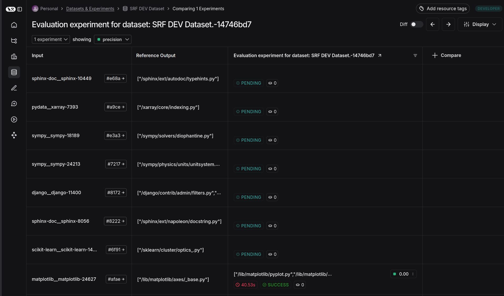
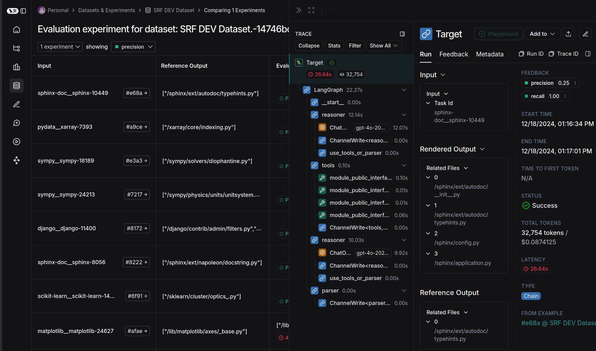

## Setup

1. Install the required packages

   ```bash
   pip install -r requirements.txt
   ```

1. Create an `.env` file in the root directory of the project with the following content:

   ```
   LANGCHAIN_API_KEY=...
   LANGCHAIN_TRACING_V2=true
   OPENAI_API_KEY=...
   ```
   
   Fill in the `LANGCHAIN_API_KEY` and `OPENAI_API_KEY` with the appropriate values.


## Run the code
2. Upload dataset to langsmith

   ```bash
   python3 minimal_reproduction/upload_dataset.py
   ```

3. Run the buggy evaluation script
   ```bash
   python3 minimal_reproduction/job.py
   ```

## Observe the bug:

Go to the langsmith page and check the status of the tasks. Even though they are finished, they are still marked as PENDING.

Tasks stuck in pending:  
  

But these tasks are finished: 


## Probable cause of the bug:

This issue can be solved by getting rid of `with tracing_v2_enabled():`.  
This can be done by replacing the function `run_task` in `minimal_reproduction/job.py` with the following code:

```python
def run_task(task_id: str) -> dict:
    """
    Search related files using the FindFilesGraph from the deep_next_0_3 repository.
    """

    logger.info(f"Running task {task_id}.")

    my_graph()

    logger.info(f"Finished task {task_id}.")

    return {"some_value": 1}
```